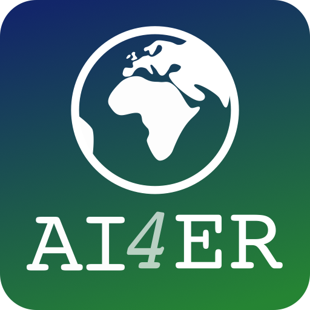

# life-hunting

All code for my AI4ER MRes project with Andrew Balmford and Tom Swinfield at the University of Cambridge.

# AI4ER MRes Project 2024

## Project Description

**Add project description!**

This work was carried out as part of the [Artificial Intelligence for Environmental Risks](https://ai4er-cdt.esc.cam.ac.uk/) (AI4ER) Centre for Doctoral Training Guided Team Challenge (GTC), which ran from November, 2023 to March, 2024.

## Documentation

-----

## Acknowledgements

We would like to thank our faculty supervisors--Ali Mashayek, Laura Cimoli, and Alberto Naveira Garabato--as well as our project mentors--Josh Lanham and Kate Oglethorpe. Their guidance throughout was instrumental in our success as a team. We would also like to thank the AI4ER support staff--Annabelle Scott and Adriana Dote--for their help navigating the complex logistics of the GTC.

-----

## License and Citation

If you use the code in this repository, please consider citing it--see the [`citation.cff`](citation.cff) file or use the "Cite this repository" function on the right sidebar. All code is under the MIT license--see the [`LICENSE`](LICENSE) file.

-----

## Data Availability

-----

  
  

